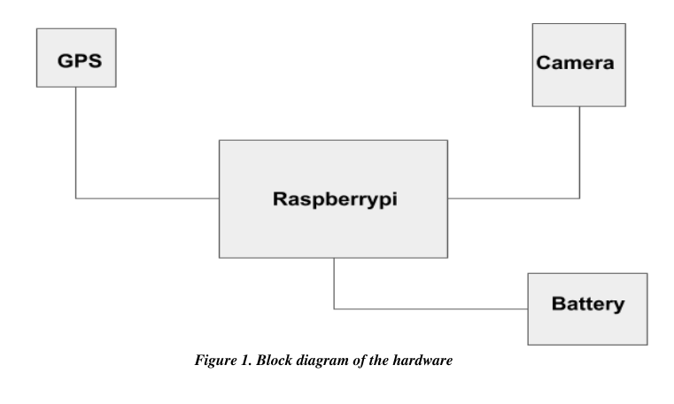
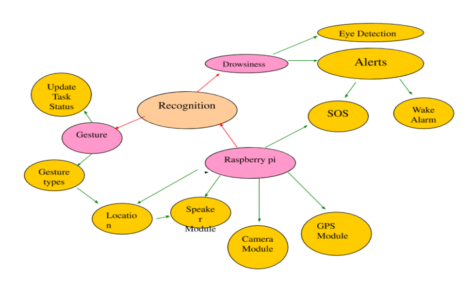

smart_driving
youtube link - https://www.youtube.com/watch?v=PLdYZDPwGek

```
Version 1.
Prepared by Team Procrastinators
7/01/
```

### Table of Contents

**1. Introduction**
1.1 Purpose 1
1.2 Scope
**2. System Interfaces**
2.1 Hardware Interface
2.2 Software Interface 2
**3. Product Functions**
3.1 Search nearby places
3.2 SOS calling
3.3 Drowsiness Detector
**4. Limitations**
**5. Future Implementation 5**


### 1. Introduction

**1.1 Purpose**
The purpose of the project is to use powerful technologies to solve the problem of distractions to
the driver while driving. Project uses various computer vision algorithms to detect and alert the
driver.
**1.2 Scope**
The project focuses on providing cutting edge technology to prevent road accidents. Project can be
used to reduce the rate of casualties due to road accidents mainly due to distractions. The project focus on
providing overall comfort to drivers.

### 2. System Interfaces

**2.1 Hardware interface**
Hardware consists of raspberry pi,a GPS module and a camera module. Power supply to the
module will be given by the battery of the car and access of internet will be provided to the module
via hotspot of the mobile phone.



**2.2 Software Interface**
The software in the module is a python script which manages all the working of the
module.three main scripts are provided

1. Drowsiness detection script
2. SOS calling script
3. Hand gesture recognition script
4. Near-by places script




**3. Product Functions**

### 3.1 Search nearby places

1. First it collects exact gps location of the driver using the GPS module embedded
    with the raspberry pi.
2. Initiates the Google Places api and send the GPS coordinates to it.
3. Receives 10 nearby places and finds the distance between those GPS coordinates
and current location using google Distance Matrix api.
4. Speaks the nearest place and its distance using gTTS python library.
**3.2 SOS calling**
Twilio platform is used for making SOS calling to registered family members
**3.3 Drowsiness Detector**
1. First, we’ll set up a camera that monitors a stream for faces.
2. if a face is found, we apply facial landmark detection and extract the eye
regions.
3. we can compute the eye aspect ratio (detailed here ) to determine if the eyes
are closed.
4. If the eye aspect ratio indicates that the eyes have been closed for a
sufficiently long enough amount of time, we’ll sound an alarm to wake up the
driver:

### 4. Limitations

The module cannot work when there is no internet connection.


### 5. Future implementation

1. Google assistant integration.
2. Driver authentication.
3. Integration with mechanical parts of a car.


